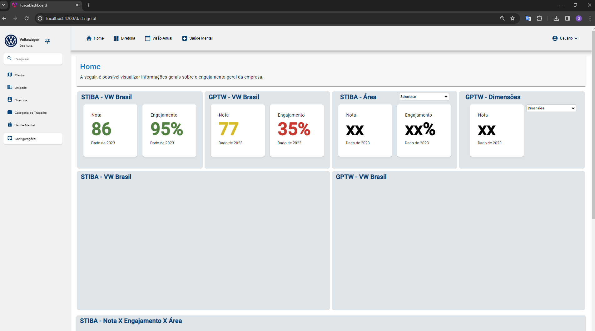

# 2024-T0004-SI09-G01-DASHBOARD

## Introdução

Esta documentação é uma visão geral do frontend deste projeto, incluindo a configuração do ambiente de desenvolvimento, a estrutura do projeto, os padrões de codificação e as boas práticas utilizadas. 

## Pré-requisitos

**Node.js e npm (Node Package Manager):**
  - Angular requer o Node.js. Você pode baixar e instalar a versão mais recente do Node.js no site oficial: Node.js.
  - O npm (Node Package Manager) é incluído com o Node.js e é usado para instalar e gerenciar as dependências do projeto.

**Angular CLI (Command Line Interface):**
  - Ferramenta de linha de comando que facilita a criação, construção e gerenciamento de projetos Angular.

Instale o Angular CLI globalmente usando o seguinte comando no terminal:
```bash
npm install -g @angular/cli
```
- **Editor de Texto ou IDE:**
  - Escolha um editor de texto ou um ambiente de desenvolvimento integrado (IDE) para escrever código Angular. Exemplo: Visual Studio Code.

## 🔧 Criando um novo projeto

### Etapa 1: Instale o Node.js e o npm
Antes de começar, certifique-se de ter o Node.js e o npm instalados. Você pode baixá-los em [nodejs.org](https://nodejs.org/).

```bash
# Verificar a versão do Node.js e npm
node -v
npm -v
```

### Etapa 2: Instale a CLI do Angular globalmente
Abra o Terminal e execute o seguinte comando para instalar globalmente a CLI do Angular:

```bash
npm install -g @angular/cli
```

### Etapa 3: Verifique a instalação
Confirme se a CLI do Angular foi instalada corretamente usando o comando:

```bash
ng --version
```

### Etapa 4: Crie um aplicativo Angular
Para criar um novo aplicativo Angular, execute o seguinte comando, substituindo "fusca.Dashboard" pelo nome desejado:

```bash
ng new fusca.Dashboard
```

### Etapa 5: Execute o aplicativo
Acesse o diretório do aplicativo e inicie o servidor de desenvolvimento:

```bash
cd fusca.Dashboard
ng serve
```

O servidor será iniciado na porta http://localhost:4200/.

## ⛏️ Inicializando esse projeto

### Obtendo o código

- Clone o repositório do projeto:

```bash
git clone https://github.com/Inteli-College/2024-T0004-SI09-G01-DASHBOARD.git
```

- Ou faça o download do código-fonte e descompacte-o.

## Execução da aplicação

- Execute o seguinte comando para executar a aplicação
```bash
ng serve
```
- A aplicação estará acessível em http://localhost:4200.

## Estrutura de pastas

```markdown
├── app
│   ├── components
│   │   ├── card
│   │   │   ├── card.component.css
│   │   │   ├── card.component.html
│   │   │   ├── card.component.spec.ts
│   │   │   └──card.component.ts
│   │   ├── card2
│   │   │   ├── card2.component.css
│   │   │   ├── card2.component.html
│   │   │   ├── card2.component.spec.ts
│   │   │   └── card2.component.ts
│   │   ├── card3
│   │   │   ├── card3.component.css
│   │   │   ├── card3.component.html
│   │   │   ├── card3.component.spec.ts
│   │   │   └── card3.component.ts
│   │   ├── card4
│   │   │   ├── card4.component.css
│   │   │   ├── card4.component.html
│   │   │   ├── card4.component.spec.ts
│   │   │   └── card4.component.ts
│   │   ├── card5
│   │   │   ├── card5.component.css
│   │   │   ├── card5.component.html
│   │   │   ├── card5.component.spec.ts
│   │   │   └── card5.component.ts
│   │   ├── card6
│   │   │   ├── card6.component.css
│   │   │   ├── card6.component.html
│   │   │   ├── card6.component.spec.ts
│   │   │   └── card6.component.ts
│   │   ├── graphic-dash-geral
│   │   │   ├── graphic-dash-geral.component.css
│   │   │   ├── graphic-dash-geral.component.html
│   │   │   ├── graphic-dash-geral.component.spec.ts
│   │   │   └── graphic-dash-geral.component.ts
│   │   ├── header
│   │   │   ├── header.component.css
│   │   │   ├── header.component.html
│   │   │   ├── header.component.spec.ts
│   │   │   └── header.component.ts
│   │   ├── login
│   │   │   ├── login.component.css
│   │   │   ├── login.component.html
│   │   │   ├── login.component.spec.ts
│   │   │   └── login.component.ts
│   │   ├── sidebar
│   │   │   ├── sidebar.component.css
│   │   │   ├── sidebar.component.html
│   │   │   ├── sidebar.component.spec.ts
│   │   │   └── sidebar.component.ts
│   │   ├── titulo
│   │   │   ├── titulo.component.css
│   │   │   ├── titulo.component.html
│   │   │   ├── titulo.component.spec.ts
│   │   │   └── titulo.component.ts
│   │   ├── pages
│   │   │   └── dash-geral
│   │   │   │   ├── dash-geral.component.css
│   │   │   │   ├── dash-geral.component.html
│   │   │   │   ├── dash-geral.component.spec.ts
│   │   │   │   └── dash-geral.component.ts
│   ├── app.component.css
│   ├── app.component.html
│   ├── app.component.spec.ts
│   ├── app.component.ts
│   ├── app.module.ts
│   ├── main.ts
│   └── styles.css
├── assets
│   └── ...
├── favicon.ico
├── index.html
├── main.server.ts
├── main.ts
├── styles.css
├── .editorconfig
├── .gitignore
├── angular.json
├── package-lock.json
├── package.json
├── README.md
├── server.ts
├── tsconfig.app.json
├── tsconfig.json
└── tsconfig.spec.json
```
## Integrantes do projeto

- <a href="https://www.linkedin.com/in/gabriel-rocha-pinto-santos-/">Gabriel Rocha Pinto Santos</a>
- <a href="https://www.linkedin.com/in/giovanna-furlan-torres/">Giovanna Furlan Torres</a>
- <a href="https://www.linkedin.com/in/maria-lu%C3%ADsa-maia-14384a212/">Maria Luísa Vilaronga Maia</a>
- <a href="https://www.linkedin.com/in/patrick-miranda/">Patrick Victorino Miranda</a>
- <a href="https://www.linkedin.com/in/uelitonrocha/">Ueliton Moreira Rocha</a>
- <a href="https://www.linkedin.com/in/vit%C3%B3ria-rodrigues-de-oliveira/">Vitória Rodrigues de Oliveira</a>

## Demais itens

### Tecnologias utilizadas

- **Angular:** 17.2.0 -v

- **Node.js:** 20.11.1 -v 

- **TypeScript (ts):** 5.3.2 -v 

### Bibliotecas e Frameworks

**Dependências:**

- @angular/animations: ^17.2.0
- @angular/cdk: ^17.2.0
- @angular/common: ^17.2.0
- @angular/compiler: ^17.2.0
- @angular/core: ^17.2.0
- @angular/forms: ^17.2.0
- @angular/material: ^17.2.0
- @angular/platform-browser: ^17.2.0
- @angular/platform-browser-dynamic: ^17.2.0
- @angular/platform-server: ^17.2.0
- @angular/router: ^17.2.0
- @angular/ssr: ^17.2.0
- @coreui/angular: ^4.7.15
- @coreui/coreui: ^4.3.2
- @emotion/react: ^11.11.3
- @emotion/styled: ^11.11.0
- @material-ui/core: ^4.12.4
- @mui/icons-material: ^5.15.10
- @mui/material: ^5.15.10
- express: ^4.18.2
- i: ^0.3.7
- ngx-bootstrap: ^12.0.0
- rxjs: ~7.8.0
- tslib: ^2.3.0
- zone.js: ~0.14.3

**DevDependencies:**

- @angular-devkit/build-angular: ^17.2.0
- @angular/cli: ^17.2.0
- @angular/compiler-cli: ^17.2.0
- @types/express: ^4.17.17
- @types/jasmine: ~5.1.0
- @types/node: ^18.18.0
- jasmine-core: ~5.1.0
- karma: ~6.4.0
- karma-chrome-launcher: ~3.2.0
- karma-coverage: ~2.2.0
- karma-jasmine: ~5.1.0
- karma-jasmine-html-reporter: ~2.1.0
- typescript: ~5.3.2


### Deploy

As instruções detalhadas para o deploy do projeto serão adicionadas durante a próxima sprint. 

### Links úteis

- Node : https://nodejs.org/en
- Angular Material : https://material.angular.io/components/categories
- Angular Icons : https://www.angularjswiki.com/angular/angular-material-icons-list-mat-icon-list/

# Apêndice

## Criação de Branches no Projeto

Cada branch tem um propósito específico e segue uma nomenclatura padronizada para facilitar a identificação e a compreensão do seu conteúdo.

### Padrão de Nomenclatura:

**Tipo da Branch:**

- feature: Para novas funcionalidades ou melhorias.
- bugfix: Para correções de bugs.
- hotfix: Para correções críticas em produção.
- refactor: Para refatorações de código.
- chore: Para tarefas diversas relacionadas ao desenvolvimento.

**Nome da Funcionalidade ou Tarefa**

Descreve a funcionalidade ou tarefa que está sendo trabalhada.

**Sprint**

Indica a sprint específica associada à tarefa.

**Exemplo de Nomenclatura Completa**

feature/code/sprint2/login

## Fluxo de Trabalho

### Criação da Branch

Antes de iniciar o desenvolvimento de uma nova funcionalidade ou correção, é criada uma nova branch a partir da branch development. A nomenclatura reflete o tipo, nome da funcionalidade/tarefa e a sprint.

```bash
git checkout development
git pull origin development
git checkout -b feature/code/sprint2/login
```

**Desenvolvimento:**

Os desenvolvedores realizam suas alterações na branch criada, trabalhando de forma isolada na nova funcionalidade ou correção.

```bash
git add .
git commit -m "Implementação da funcionalidade de login"
```

**Integração e Revisão:**

Após concluir o desenvolvimento, uma solicitação de pull (pull request) é criada para integrar as alterações de volta à branch development. Outros membros da equipe revisam o código antes da fusão.

**Fusão e Manutenção da Branch:**

Após a revisão bem-sucedida, a branch é fundida (merge) à development. Para fins acadêmicos e de rastreabilidade, as branches não são apagadas, permitindo a referência a funcionalidades específicas em sprints anteriores.

## Telas Desenvolvidas - Sprint 1

### Login 

A página de login desenvolvida permite que os usuários acessem o sistema. Ela possui um formulário simples e intuitivo, onde o usuário deve inserir seu e-mail e senha. 

**Funcionalidades:**

- Formulário de login:
- Campos para e-mail e senha.
  
**Botão de login:**

- Efetua a autenticação do usuário no sistema.
- Redireciona o usuário para a página inicial após o login bem-sucedido.


<br>

**Observação :** Necessário desenvolvimento da autenticação e gestão de acesso para a próxima sprint. 

### Dashboard Geral

A página do dashboard desenvolvida oferece uma visão geral dos principais indicadores de desempenho (KPIs) do sistema. Ela possui um cabeçalho, uma barra lateral com filtros, um título e quatro cards com KPIs. A página também está configurada para receber três gráficos na próxima sprint.

**Funcionalidades:**

- Cabeçalho: Exibe as páginas do sistema.
- Barra lateral: Fornece filtros
- Título: Indica o nome do dashboard.
- Cards com KPIs: Exibem os principais indicadores de desempenho do sistema.




## Boas práticas utilizadas

### Git Flow: 

O Git Flow é baseado em um modelo de ramificação específico que define como as branches são criadas para facilitar o desenvolvimento, a revisão e a implantação do código. Utilizamos pois ele proporciona uma estrutura organizacional que ajuda os membros da equipe a entenderem em qual estágio do ciclo de vida uma determinada parte do código está. 

Além disso, as branches de feature são usadas para desenvolver novas funcionalidades de forma isolada para que os desenvolvedores trabalhem em suas próprias funcionalidades sem interferir no trabalho de outros.

### Nomenclatura das branchs:
- 'Development': branch principal de desenvolvimento do projeto.
- 'origin/Homologation' e 'origin/Production': branches remotas que representam os ambientes de homologação e produção, respectivamente.
- 'feature/code...:  branches de desenvolvimento de novas funcionalidades.

**Exemplo de boas práticas de nomenclatura:** 

Prefixo + Palavras-chave + Sprint Atual + Descrição: feature/code/sprint2/sidebar

### Pull Request:

Uma das boas práticas que seguimos é sempre abrir um Pull Request (PR) ao finalizar o desenvolvimento de uma funcionalidade ou correção de bug. Isso é feito para garantir que todas as alterações passem por uma revisão de código antes de serem integradas na branch de desenvolvimento principal (Development).

Ao abrir um PR, outros membros do grupo têm a oportunidade de revisar o código, fornecer feedback e isso promove a colaboração e ajuda a manter a qualidade do código.

### Código Autoexplicativo:

Prática fundamental para tornar o código-fonte o mais compreensível possível, sem a necessidade de comentários explicativos adicionais. Dessa forma, utlizamos nomes de variáveis, funções, classes e métodos que descrevem de forma clara sua finalidade.
